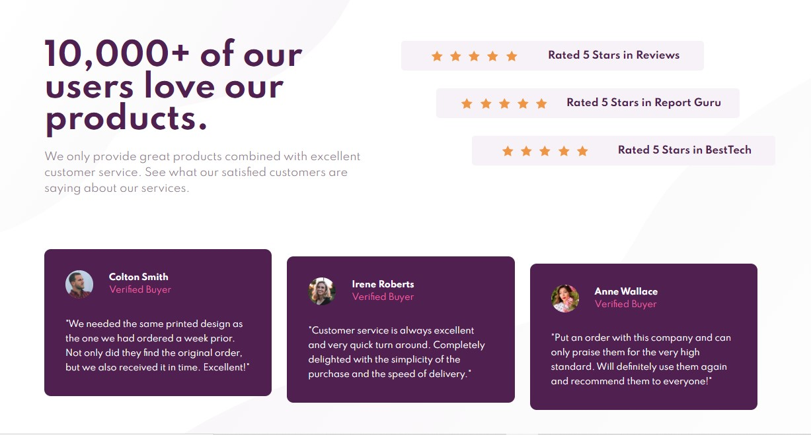

# Frontend Mentor - Social proof section solution

This is a solution to the [Social proof section challenge on Frontend Mentor](https://www.frontendmentor.io/challenges/social-proof-section-6e0qTv_bA). Frontend Mentor challenges help you improve your coding skills by building realistic projects.

## Table of contents

- [Overview](#overview)
  - [The challenge](#the-challenge)
  - [Final Work](#Final-Work)
  - [Links](#links)
- [My process](#my-process)
  - [Built with](#built-with)
  - [What I learned](#what-i-learned)
- [Author](#author)

## Overview

### The challenge

Users should be able to:

- View the optimal layout for the section depending on their device's screen size

### Final Work



### Links

- Solution URL: [https://www.frontendmentor.io/solutions/social-proof-section-5yz0VfIZJ](https://www.frontendmentor.io/solutions/social-proof-section-5yz0VfIZJ)
- Live Site URL: [https://social-proof-section-gamma-two.vercel.app/](https://social-proof-section-gamma-two.vercel.app/)

## My process

### Built with

- Semantic HTML5 markup
- CSS custom properties
- Flexbox

### What I learned

Learnt how to place and position images into the main document background. I'm pretty sure all the `background-*:` properties can be placed in the general `background:` property, but to make it more readable and clean, I used them individually.

```css
body {
  background: url(./images/bg-pattern-top-desktop.svg),
    url(./images/bg-pattern-bottom-desktop.svg);
  background-repeat: no-repeat, no-repeat;
  background-size: 600px, 1500px 900px;
  background-position: left top, 100px 30px;
  font-size: 15px;
  display: flex;
  align-items: center;
  justify-content: center;
}
```

I completed a [similar project](https://github.com/Pap-Ski/FrontendMentorsSolutions/tree/master/ProfileCardComponent) which had a background image as well, but used a naive approach to it.

## Author

- LinkedIn - [Quartey-Papafio Nii Laryea](https://www.linkedin.com/in/nii-laryea-quartey-papafio-229440176/)
- Frontend Mentor - [@Pap-Ski](https://www.frontendmentor.io/profile/Pap-Ski)
